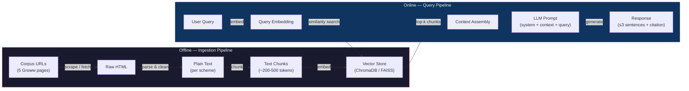
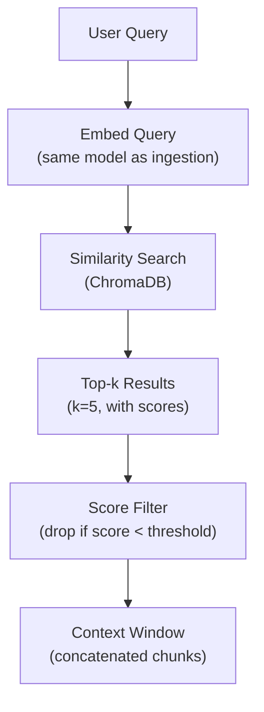
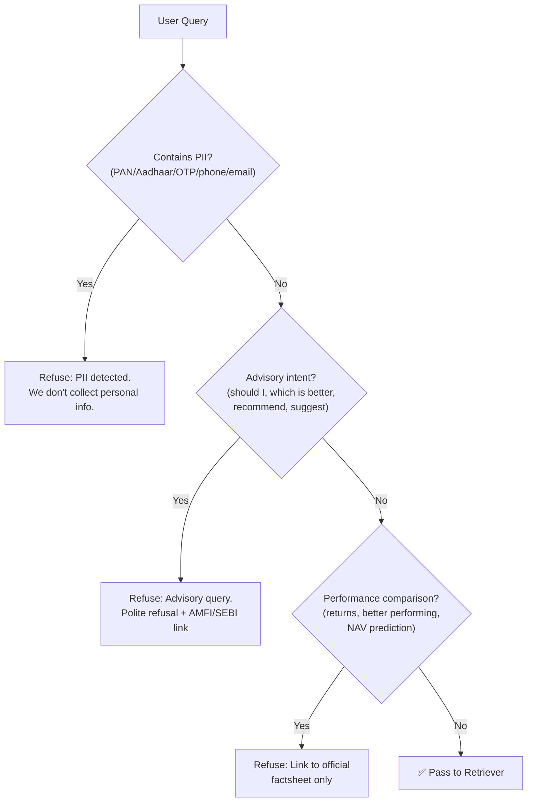
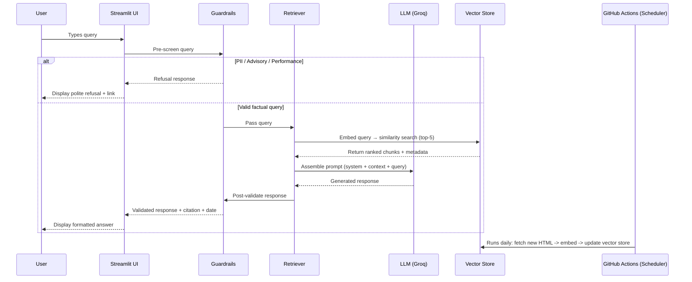

# Architecture — Mutual Fund FAQ Assistant

> A detailed technical architecture for the RAG-based, facts-only FAQ chatbot described in [context.md](file:///Users/sanjeevjha/Desktop/RAG%20Chatbot/docs/context.md).

---

## 1. System Overview

The system is a **Retrieval-Augmented Generation (RAG)** pipeline with a minimal chat UI. It ingests official mutual-fund web pages, chunks and embeds the content into a vector store, and at query time retrieves the most relevant chunks to ground an LLM-generated, facts-only answer.

### High-Level Data Flow



---

## 2. Component Architecture

The system is composed of **six core components**. Each runs as a Python module and can be invoked independently.

```
┌─────────────────────────────────────────────────────────────────┐
│                        Chat UI (Streamlit)                      │
│  welcome message · 3 example questions · disclaimer banner      │
└──────────────────────────────┬──────────────────────────────────┘
                               │  user query (text)
                               ▼
┌──────────────────────────────────────────────────────────────────┐
│                     Query Processing Layer                       │
│                                                                  │
│  ┌──────────────┐  ┌──────────────┐  ┌────────────────────────┐ │
│  │  Guardrails  │  │  Retriever   │  │  Response Generator    │ │
│  │  (pre-check) │─▶│  (vector DB) │─▶│  (LLM + prompt)       │ │
│  └──────────────┘  └──────────────┘  └────────────────────────┘ │
│         │                                       │                │
│         │ refuse advisory ───────────────────── │ facts-only     │
│         ▼                                       ▼                │
│  ┌──────────────────────────────────────────────────────────────┐│
│  │              Formatted Response + Citation + Date            ││
│  └──────────────────────────────────────────────────────────────┘│
└──────────────────────────────────────────────────────────────────┘

              ┌──────────────────────────────┐
              │    Offline Ingestion Engine   │
              │  scraper → parser → chunker  │
              │  → embedder → vector store   │
              └──────────────────────────────┘
                             ▲
                             │
              ┌──────────────┴───────────────┐
              │  Scheduler (GitHub Actions)  │
              │   triggers daily ingestion   │
              └──────────────────────────────┘
```

---

## 3. Component Deep-Dives

### 3.1 Document Ingestion Pipeline

**Purpose:** Fetch, parse, chunk, and embed the corpus into a persistent vector store.

| Stage | Description | Key Details |
|-------|-------------|-------------|
| **Scraping** | Fetch HTML from the 5 Groww corpus URLs | Use `requests` + `BeautifulSoup` or `Playwright` (for JS-rendered content). Respect `robots.txt`. |
| **Parsing** | Extract meaningful text from raw HTML | Strip navbars, footers, ads. Retain structured data (tables, key-value pairs). Attach metadata: `scheme_name`, `category`, `source_url`, `scrape_date`. |
| **Chunking** | Split parsed text into retrieval-friendly chunks | Strategy: **Recursive character splitting** with ~400 token chunks, ~50 token overlap. Preserve table rows and key-value pairs as atomic units. |
| **Embedding** | Convert chunks to dense vector representations | Model: `BAAI/bge-small-en-v1.5` (384-dim, BGE family — optimized for retrieval, outperforms MiniLM on most benchmarks). |
| **Storage** | Persist embeddings + metadata in a vector store | Store: **ChromaDB** (lightweight, file-based, no infra needed). Each document stored with metadata: `scheme_name`, `source_url`, `chunk_index`, `scrape_date`. |

#### Corpus URLs (Ingestion Input)

| # | Scheme | URL |
|---|--------|-----|
| 1 | HDFC Large Cap Fund – Direct Plan Growth | `https://groww.in/mutual-funds/hdfc-large-cap-fund-direct-growth` |
| 2 | HDFC Mid Cap Fund – Direct Plan Growth | `https://groww.in/mutual-funds/hdfc-mid-cap-fund-direct-growth` |
| 3 | HDFC Small Cap Fund – Direct Plan Growth | `https://groww.in/mutual-funds/hdfc-small-cap-fund-direct-growth` |
| 4 | HDFC Gold ETF Fund of Fund – Direct Plan Growth | `https://groww.in/mutual-funds/hdfc-gold-etf-fund-of-fund-direct-plan-growth` |
| 5 | HDFC Silver ETF FoF – Direct Plan Growth | `https://groww.in/mutual-funds/hdfc-silver-etf-fof-direct-growth` |

#### Chunk Metadata Schema

```json
{
  "chunk_id": "hdfc-large-cap_chunk_007",
  "scheme_name": "HDFC Large Cap Fund – Direct Plan Growth",
  "category": "Large Cap (Equity)",
  "source_url": "https://groww.in/mutual-funds/hdfc-large-cap-fund-direct-growth",
  "chunk_index": 7,
  "scrape_date": "2026-06-28",
  "content": "The expense ratio of HDFC Large Cap Fund Direct Plan is 1.07%..."
}
```

---

### 3.2 Vector Store

**Purpose:** Persistent storage of embedded chunks for efficient similarity search.

| Property | Choice | Rationale |
|----------|--------|-----------|
| **Engine** | ChromaDB | Zero-infra, file-based, Python-native. Perfect for a small corpus (~100-200 chunks). |
| **Embedding dim** | 384 | Matches `BAAI/bge-small-en-v1.5` output. |
| **Distance metric** | Cosine similarity | Standard for sentence embeddings. |
| **Persistence** | Local directory (`data/vectorstore/`) | Simple file-based persistence; no database server needed. |
| **Collection name** | `hdfc_mf_corpus` | Single collection for all 5 schemes. |

#### Alternative (if scaling needed)
- **FAISS** — for pure in-memory speed on larger corpora
- **Pinecone / Weaviate** — for cloud-hosted, managed vector DBs (overkill for this scope)

---

### 3.3 Retrieval Module

**Purpose:** At query time, embed the user's question and find the most relevant chunks.



| Parameter | Value | Notes |
|-----------|-------|-------|
| **Top-k** | 5 | Retrieve 5 most similar chunks |
| **Score threshold** | 0.3 (cosine) | Drop chunks with low relevance to avoid noise |
| **Re-ranking** | Optional (cross-encoder) | Can add `cross-encoder/ms-marco-MiniLM-L-6-v2` for improved precision |
| **Max context tokens** | ~1500 | Keeps the LLM prompt within reasonable limits |

#### Context Assembly

Retrieved chunks are concatenated into a structured context block:

```
--- Context Chunk 1 (Source: HDFC Large Cap Fund) ---
The expense ratio of HDFC Large Cap Fund Direct Plan is 1.07%...

--- Context Chunk 2 (Source: HDFC Large Cap Fund) ---
Exit load: 1% if redeemed within 1 year...
```

---

### 3.4 Generation Module (LLM)

**Purpose:** Produce a concise, grounded, facts-only answer from the retrieved context.

| Property | Choice | Rationale |
|----------|--------|-----------|
| **LLM Provider** | Groq Cloud API | Ultra-low latency inference (~10× faster than typical cloud LLMs), generous free tier. |
| **Model** | `llama-3.3-70b-versatile` | Strong instruction-following, factual grounding, and concise output. Best balance of speed and quality on Groq. |
| **Alternative** | `mixtral-8x7b-32768` or `llama-3.1-8b-instant` (via Groq) | Swap via config; interface stays the same. |
| **Temperature** | 0.1 | Near-deterministic for factual consistency |
| **Max output tokens** | 200 | Enforces brevity (≤3 sentences) |

#### System Prompt (Core)

```text
You are a facts-only mutual fund FAQ assistant. You answer objective,
verifiable questions about HDFC Mutual Fund schemes using ONLY the
provided context.

RULES:
1. Answer in a MAXIMUM of 3 sentences.
2. Include EXACTLY ONE citation link to the source URL from the context.
3. End every response with: "Last updated from sources: <date>"
4. If the context does not contain the answer, say:
   "I don't have this information in my current sources."
5. NEVER provide investment advice, opinions, or recommendations.
6. NEVER compare fund performance or calculate returns.
7. For performance-related queries, provide only the official factsheet link.
8. NEVER ask for or acknowledge PAN, Aadhaar, account numbers, OTPs,
   email addresses, or phone numbers.
```

#### Prompt Template

```text
SYSTEM: {system_prompt}

CONTEXT:
{retrieved_chunks}

USER QUERY: {user_query}

ASSISTANT:
```

---

### 3.5 Guardrails Module

**Purpose:** Pre-screen queries and post-validate responses to enforce hard constraints.

#### Pre-Generation Guardrails (Input Filtering)



| Guard | Detection Method | Response |
|-------|-----------------|----------|
| **PII Detection** | Regex patterns for PAN (`[A-Z]{5}[0-9]{4}[A-Z]`), Aadhaar (`\d{4}\s?\d{4}\s?\d{4}`), phone, email | Polite refusal, no data stored |
| **Advisory Intent** | Keyword + LLM classifier: "should I", "recommend", "better", "suggest", "which fund" | Polite refusal + AMFI investor education link |
| **Performance Query** | Keywords: "returns", "performance", "CAGR", "NAV prediction" | Redirect to official factsheet URL |
| **Out-of-Scope** | Query about a scheme not in corpus | Inform user of covered schemes |

#### Post-Generation Guardrails (Output Validation)

| Check | Rule | Fallback |
|-------|------|----------|
| **Sentence count** | ≤ 3 sentences | Truncate or regenerate |
| **Citation present** | Exactly 1 source URL | Append source URL from top-retrieved chunk |
| **Footer present** | `"Last updated from sources: <date>"` | Append automatically |
| **No advice leaked** | Scan for advisory language | Strip or regenerate |

---

### 3.6 Chat UI (Streamlit)

**Purpose:** Minimal, user-friendly interface for interacting with the FAQ assistant.

#### UI Layout

```
┌─────────────────────────────────────────────────────┐
│  🏦 Mutual Fund FAQ Assistant                       │
│                                                     │
│  ⚠️ Facts-only. No investment advice.               │
│                                                     │
│  ┌───────────────────────────────────────────────┐  │
│  │  Welcome! I can answer factual questions       │  │
│  │  about HDFC Mutual Fund schemes.               │  │
│  │                                                │  │
│  │  Try asking:                                   │  │
│  │  💡 "What is the expense ratio of HDFC Large   │  │
│  │      Cap Fund?"                                │  │
│  │  💡 "What is the exit load for HDFC Mid Cap    │  │
│  │      Fund?"                                    │  │
│  │  💡 "What is the minimum SIP amount for HDFC   │  │
│  │      Small Cap Fund?"                          │  │
│  └───────────────────────────────────────────────┘  │
│                                                     │
│  ┌─── Chat History ──────────────────────────────┐  │
│  │ 🧑 User: What is the expense ratio of HDFC    │  │
│  │          Large Cap Fund?                       │  │
│  │                                                │  │
│  │ 🤖 Bot: The expense ratio of HDFC Large Cap   │  │
│  │   Fund Direct Plan is 1.07%.                   │  │
│  │   Source: https://groww.in/mutual-funds/...    │  │
│  │   Last updated from sources: 2026-06-28        │  │
│  └───────────────────────────────────────────────┘  │
│                                                     │
│  ┌───────────────────────────────────┐ [Send]       │
│  │ Type your question here...        │              │
│  └───────────────────────────────────┘              │
└─────────────────────────────────────────────────────┘
```

#### UI Components

| Component | Implementation |
|-----------|---------------|
| **Framework** | Streamlit (`streamlit run app.py`) |
| **Welcome message** | `st.markdown()` with styled welcome card |
| **Example questions** | Clickable `st.button()` chips |
| **Disclaimer** | Persistent `st.warning()` banner |
| **Chat history** | `st.session_state` + `st.chat_message()` |
| **Input** | `st.chat_input()` |

---

### 3.7 Scheduler Module

**Purpose:** Automate the execution of the Offline Ingestion Engine on a recurring basis so that the Mutual Fund data is always up to date.

| Property | Choice | Rationale |
|----------|--------|-----------|
| **Platform** | GitHub Actions | Zero-cost, integrated with the repository, easy to configure via YAML. |
| **Schedule** | Daily (Cron) | Runs once a day to capture any NAV updates or factsheet changes. |
| **Workflow** | `daily_ingestion.yml` | Sets up Python, installs dependencies, runs `scripts/ingest.py`, and commits updated vector DB back to the repo. |

---

## 4. Data Flow — End-to-End Query Lifecycle



---

## 5. Technology Stack

| Layer | Technology | Version | Purpose |
|-------|-----------|---------|---------|
| **Language** | Python | 3.10+ | Core runtime |
| **Web Scraping** | `requests` + `BeautifulSoup4` | latest | Fetch & parse corpus pages |
| **JS Rendering** (if needed) | `Playwright` | latest | Handle JS-rendered Groww pages |
| **Chunking** | `LangChain` `RecursiveCharacterTextSplitter` | latest | Intelligent text splitting |
| **Embeddings** | `sentence-transformers` (`BAAI/bge-small-en-v1.5`) | latest | Dense vector embeddings (384-dim, BGE family) |
| **Vector Store** | `ChromaDB` | latest | Persistent local vector storage |
| **LLM** | Groq Cloud API (`llama-3.3-70b-versatile`) | latest | Ultra-fast response generation |
| **LLM SDK** | `groq` (Python SDK) | latest | Groq API client |
| **LLM Framework** | `LangChain` | latest | Chain orchestration, prompt templates |
| **Guardrails** | Custom Python module + regex | — | PII detection, intent classification |
| **UI** | `Streamlit` | latest | Chat interface |
| **Config** | `python-dotenv` | latest | API keys & environment variables |

---

## 6. Project Directory Structure

```
RAG Chatbot/
├── app.py                      # Streamlit entry point
├── requirements.txt            # Python dependencies
├── .env.example                # Template for API keys
├── .env                        # (gitignored) Actual API keys
├── .gitignore
├── README.md
│
├── docs/
│   ├── problemstatement.txt    # Original problem statement
│   ├── context.md              # Project context & requirements
│   └── architecture.md         # This file
│
├── src/
│   ├── __init__.py
│   │
│   ├── ingestion/
│   │   ├── __init__.py
│   │   ├── scraper.py          # Fetch HTML from corpus URLs
│   │   ├── parser.py           # Extract clean text from HTML
│   │   ├── chunker.py          # Split text into chunks
│   │   └── embedder.py         # Embed chunks & store in vector DB
│   │
│   ├── retrieval/
│   │   ├── __init__.py
│   │   ├── retriever.py        # Query embedding + similarity search
│   │   └── reranker.py         # (Optional) Cross-encoder re-ranking
│   │
│   ├── generation/
│   │   ├── __init__.py
│   │   ├── llm_client.py       # LLM API wrapper (Groq)
│   │   ├── prompt_templates.py # System prompt & response templates
│   │   └── generator.py        # End-to-end generate-from-context
│   │
│   ├── guardrails/
│   │   ├── __init__.py
│   │   ├── pii_detector.py     # Regex-based PII detection
│   │   ├── intent_classifier.py# Advisory/performance query detection
│   │   └── output_validator.py # Post-generation response checks
│   │
│   └── config.py               # Centralized configuration
│
├── data/
│   ├── raw/                    # Scraped HTML (cached)
│   ├── processed/              # Parsed & chunked text
│   └── vectorstore/            # ChromaDB persistence directory
│
├── scripts/
│   ├── ingest.py               # CLI script to run full ingestion
│   └── test_query.py           # CLI script to test queries
│
└── tests/
    ├── test_scraper.py
    ├── test_chunker.py
    ├── test_retriever.py
    ├── test_guardrails.py
    └── test_generator.py
```

---

## 7. Configuration & Environment

### Environment Variables (`.env`)

```env
# LLM Provider (Groq)
GROQ_API_KEY=your-groq-api-key-here

# Vector Store
CHROMA_PERSIST_DIR=./data/vectorstore
CHROMA_COLLECTION_NAME=hdfc_mf_corpus

# Embedding Model (BGE)
EMBEDDING_MODEL=BAAI/bge-small-en-v1.5

# Retrieval
RETRIEVAL_TOP_K=5
RETRIEVAL_SCORE_THRESHOLD=0.3

# LLM (Groq)
LLM_MODEL=llama-3.3-70b-versatile
LLM_TEMPERATURE=0.1
LLM_MAX_TOKENS=200

# Ingestion
CHUNK_SIZE=400
CHUNK_OVERLAP=50
```

### Configuration Module (`src/config.py`)

Loads `.env` and exposes typed configuration constants used across all modules, ensuring a single source of truth for all parameters.

---

## 8. API & Interface Contracts

### Internal Module Interfaces

#### Ingestion Pipeline

```python
# scraper.py
def scrape_url(url: str) -> str:
    """Fetch and return raw HTML from a corpus URL."""

# parser.py
def parse_html(html: str, source_url: str) -> dict:
    """Extract clean text + metadata from raw HTML.
    Returns: { 'text': str, 'scheme_name': str, 'source_url': str, 'scrape_date': str }
    """

# chunker.py
def chunk_text(document: dict, chunk_size: int, overlap: int) -> list[dict]:
    """Split document text into overlapping chunks with metadata.
    Returns: [{ 'content': str, 'chunk_id': str, 'metadata': dict }, ...]
    """

# embedder.py
def embed_and_store(chunks: list[dict], collection_name: str) -> None:
    """Embed chunks and upsert into ChromaDB collection."""
```

#### Query Pipeline

```python
# retriever.py
def retrieve(query: str, top_k: int = 5) -> list[dict]:
    """Embed query and return top-k relevant chunks.
    Returns: [{ 'content': str, 'metadata': dict, 'score': float }, ...]
    """

# generator.py
def generate_answer(query: str, context_chunks: list[dict]) -> dict:
    """Generate a grounded response from context.
    Returns: { 'answer': str, 'citation_url': str, 'last_updated': str }
    """

# guardrails (pre)
def screen_query(query: str) -> dict:
    """Pre-screen user query.
    Returns: { 'allowed': bool, 'refusal_response': str | None, 'reason': str }
    """

# guardrails (post)
def validate_response(response: dict) -> dict:
    """Post-validate generated response for format compliance.
    Returns: { 'valid': bool, 'corrected_response': dict }
    """
```

---

## 9. Error Handling Strategy

| Scenario | Handling |
|----------|----------|
| **Scraping fails** (URL down / blocked) | Retry 3× with exponential backoff → log warning → skip URL → report in ingestion summary |
| **No relevant chunks found** | Return: "I don't have this information in my current sources." with covered-schemes list |
| **LLM API error** | Retry 2× → fallback to cached response or graceful error message |
| **LLM returns advisory content** | Post-generation guardrail catches → regenerate with stricter prompt |
| **PII in query** | Immediate refusal, query is NOT logged or stored |
| **ChromaDB corruption** | Re-run ingestion from cached raw HTML in `data/raw/` |

---

## 10. Deployment Architecture

### Local Development (Primary)

```
┌───────────────────────────────────┐
│         Developer Machine         │
│                                   │
│  streamlit run app.py             │
│  ┌───────────┐  ┌──────────────┐  │
│  │ Streamlit │  │  ChromaDB    │  │
│  │ (port     │  │  (file-based)│  │
│  │  8501)    │  │              │  │
│  └─────┬─────┘  └──────────────┘  │
│        │                          │
│        ├── Groq API (external)    │
│        └── HuggingFace (embed)    │
└───────────────────────────────────┘
```

### Production (Future — Optional)

| Component | Service |
|-----------|---------|
| **Hosting** | Streamlit Cloud / Hugging Face Spaces / Railway |
| **Vector Store** | Managed ChromaDB or Pinecone (if scaling) |
| **Secrets** | Platform-native secret management |
| **CI/CD** | GitHub Actions → auto-deploy on push to `main` |

---

## 11. Security Considerations

| Concern | Mitigation |
|---------|-----------|
| **API key exposure** | Stored in `.env`, never committed (`.gitignore`). Use platform secrets in production. |
| **PII in queries** | Regex pre-screening blocks PII before any processing. Queries with PII are never logged. |
| **Prompt injection** | System prompt is hardcoded, not user-modifiable. User input is sandboxed within the `USER QUERY` field. |
| **Data exfiltration** | No outbound data flow except LLM API calls. No user data is stored persistently. |
| **Corpus integrity** | Only official Groww URLs in the allow-list. Supplementary sources must be from AMC/AMFI/SEBI domains. |

---

## 12. Testing Strategy

| Test Type | Scope | Tools |
|-----------|-------|-------|
| **Unit tests** | Individual modules (scraper, parser, chunker, guardrails) | `pytest` |
| **Integration tests** | End-to-end query pipeline (retrieval → generation → validation) | `pytest` + mock LLM |
| **Guardrail tests** | PII detection, advisory classification, output format validation | `pytest` with edge-case fixtures |
| **Manual QA** | UI walkthrough, example queries, refusal scenarios | Manual checklist |

### Sample Test Cases

| # | Query | Expected Behavior |
|---|-------|-------------------|
| 1 | "What is the expense ratio of HDFC Large Cap Fund?" | Factual answer + citation + date |
| 2 | "Should I invest in HDFC Mid Cap Fund?" | Polite refusal + AMFI link |
| 3 | "My PAN is ABCDE1234F, check my portfolio" | PII refusal, query not logged |
| 4 | "Which fund gave better returns?" | Refusal + factsheet link |
| 5 | "What is the exit load for HDFC Gold ETF FoF?" | Factual answer + citation + date |
| 6 | "Tell me about Axis Bluechip Fund" | Out-of-scope, inform covered schemes |

---

*Derived from [context.md](file:///Users/sanjeevjha/Desktop/RAG%20Chatbot/docs/context.md) and [problemstatement.txt](file:///Users/sanjeevjha/Desktop/RAG%20Chatbot/docs/problemstatement.txt)*
