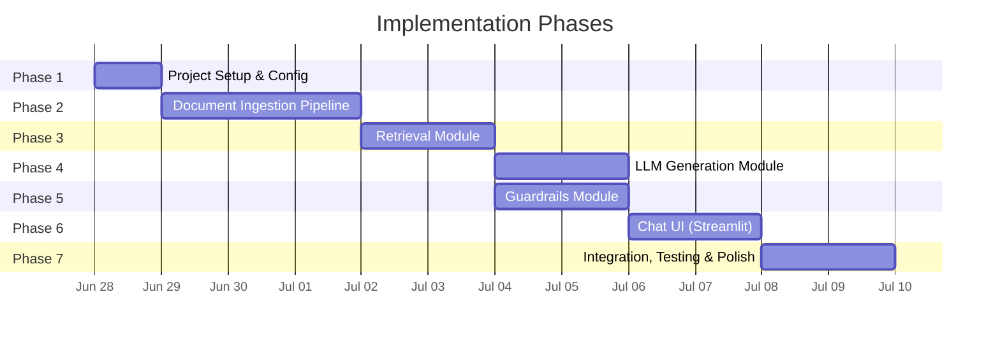
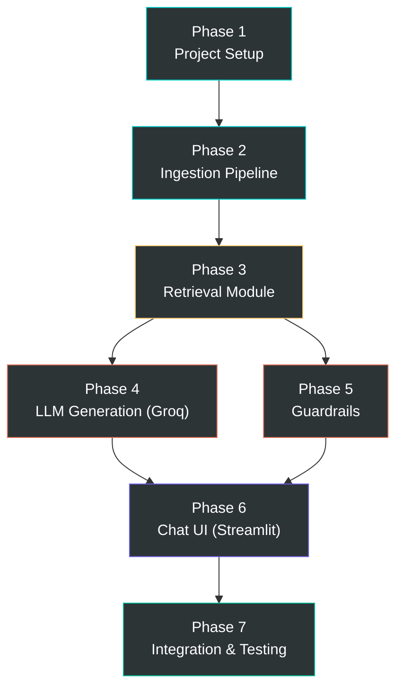

# Implementation Plan — Mutual Fund FAQ Assistant

> Phase-wise execution plan derived from [architecture.md](file:///Users/sanjeevjha/Desktop/RAG%20Chatbot/docs/architecture.md) and [context.md](file:///Users/sanjeevjha/Desktop/RAG%20Chatbot/docs/context.md).

---

## Overview

The implementation is divided into **6 phases**, ordered by dependency — each phase builds on the outputs of the previous one. The project follows a bottom-up approach: data layer first, then retrieval, then generation, then guardrails, then UI, and finally testing & polish.



---

## Phase 1 — Project Setup & Configuration

**Goal:** Establish the project skeleton, install dependencies, and configure environment variables.

### Tasks

| # | Task | File(s) | Status |
|---|------|---------|--------|
| 1.1 | Create project directory structure as defined in architecture | All directories | `[ ]` |
| 1.2 | Initialize Python virtual environment (`venv`) | — | `[ ]` |
| 1.3 | Create `requirements.txt` with all dependencies | `requirements.txt` | `[ ]` |
| 1.4 | Create `.env.example` with all config keys (no secrets) | `.env.example` | `[ ]` |
| 1.5 | Create `.gitignore` (exclude `.env`, `data/`, `__pycache__/`, etc.) | `.gitignore` | `[ ]` |
| 1.6 | Implement `src/config.py` — load `.env`, expose typed constants | `src/config.py` | `[ ]` |
| 1.7 | Create `__init__.py` for all packages | `src/*/__init__.py` | `[ ]` |
| 1.8 | Verify: `python -c "from src.config import *"` runs without errors | — | `[ ]` |

### Dependencies (Python Packages)

```txt
# Core
requests
beautifulsoup4
langchain
langchain-community
chromadb
sentence-transformers
groq
python-dotenv
streamlit

# Optional
playwright       # if JS rendering needed
lxml             # faster HTML parsing
```

### Environment Variables (`.env.example`)

```env
# LLM Provider (Groq)
GROQ_API_KEY=your-groq-api-key-here

# Embedding Model (BGE)
EMBEDDING_MODEL=BAAI/bge-small-en-v1.5

# Vector Store
CHROMA_PERSIST_DIR=./data/vectorstore
CHROMA_COLLECTION_NAME=hdfc_mf_corpus

# Retrieval
RETRIEVAL_TOP_K=5
RETRIEVAL_SCORE_THRESHOLD=0.3

# LLM (Groq)
LLM_MODEL=llama-3.3-70b-versatile
LLM_TEMPERATURE=0.1
LLM_MAX_TOKENS=200

# Ingestion
CHUNK_SIZE=500
CHUNK_OVERLAP=50
```

### Directory Structure to Create

```
RAG Chatbot/
├── app.py
├── requirements.txt
├── .env.example
├── .gitignore
├── README.md
├── docs/
├── src/
│   ├── __init__.py
│   ├── config.py
│   ├── ingestion/
│   │   └── __init__.py
│   ├── retrieval/
│   │   └── __init__.py
│   ├── generation/
│   │   └── __init__.py
│   └── guardrails/
│       └── __init__.py
├── data/
│   ├── raw/
│   ├── processed/
│   └── vectorstore/
├── scripts/
└── tests/
```

### Deliverables
- ✅ Working project skeleton with all directories
- ✅ `requirements.txt` with pinned dependencies
- ✅ `src/config.py` loading all env vars
- ✅ Virtual environment with all packages installed

### Verification
```bash
# Create venv and install
python -m venv venv
source venv/bin/activate
pip install -r requirements.txt

# Verify config loads
python -c "from src.config import *; print('Config OK')"
```

---

## Phase 2 — Document Ingestion Pipeline

**Goal:** Scrape the 5 Groww corpus URLs, parse HTML to clean text, chunk the text, embed using BGE model, and store in ChromaDB.

**Depends on:** Phase 1 (config, dependencies)

### Tasks

| # | Task | File(s) | Status |
|---|------|---------|--------|
| 2.1 | Implement `scraper.py` — fetch HTML from corpus URLs | `src/ingestion/scraper.py` | `[ ]` |
| 2.2 | Implement `parser.py` — extract clean text + metadata from HTML | `src/ingestion/parser.py` | `[ ]` |
| 2.3 | Implement `chunker.py` — recursive character splitting with overlap | `src/ingestion/chunker.py` | `[ ]` |
| 2.4 | Implement `embedder.py` — embed chunks with BGE and upsert to ChromaDB | `src/ingestion/embedder.py` | `[x]` |
| 2.5 | Create `scripts/ingest.py` — CLI orchestrator for full pipeline | `scripts/ingest.py` | `[x]` |
| 2.6 | Run full ingestion and inspect vectorstore contents | — | `[x]` |
| 2.7 | Write unit tests for scraper, parser, chunker | `tests/test_scraper.py`, etc. | `[ ]` |

### Sub-Task Details

#### 2.1 — Scraper (`src/ingestion/scraper.py`)

```python
def scrape_url(url: str) -> str:
    """Fetch raw HTML from a corpus URL.
    - Use requests with User-Agent header
    - Retry 3x with exponential backoff
    - Cache raw HTML to data/raw/<scheme_slug>.html
    - Raise ScrapingError on failure
    """
```

**Corpus URLs to scrape:**

| # | URL |
|---|-----|
| 1 | `https://groww.in/mutual-funds/hdfc-large-cap-fund-direct-growth` |
| 2 | `https://groww.in/mutual-funds/hdfc-mid-cap-fund-direct-growth` |
| 3 | `https://groww.in/mutual-funds/hdfc-small-cap-fund-direct-growth` |
| 4 | `https://groww.in/mutual-funds/hdfc-gold-etf-fund-of-fund-direct-plan-growth` |
| 5 | `https://groww.in/mutual-funds/hdfc-silver-etf-fof-direct-growth` |

> [!IMPORTANT]
> Groww pages may be JavaScript-rendered. If `requests` returns incomplete content, fall back to **Playwright** for headless browser rendering.

#### 2.2 — Parser (`src/ingestion/parser.py`)

```python
def parse_html(html: str, source_url: str) -> dict:
    """Extract structured text from raw HTML.
    Returns: {
        'text': str,           # clean text content
        'scheme_name': str,    # extracted from page title/heading
        'category': str,       # e.g., 'Large Cap (Equity)'
        'source_url': str,     # original URL
        'scrape_date': str     # ISO date
    }
    """
```

Key parsing rules:
- Strip navigation, footer, ads, scripts, styles
- Preserve table data as structured key-value text (e.g., `"Expense Ratio: 1.07%"`)
- Preserve section headings for chunk context
- Extract scheme name from `<h1>` or page title

#### 2.3 — Chunker (`src/ingestion/chunker.py`)

> [!IMPORTANT]
> **Updated based on parsed data analysis.** The parser outputs structured text with 8 clearly delineated `## Section` headers per fund. Most sections are small (50–180 chars) and should be kept as **atomic chunks** — splitting them further would destroy their semantic coherence. Only the "About This Fund" (~700 chars) and "FAQs" (~2,500 chars) sections are large enough to warrant sub-splitting.

**Strategy: Section-Aware Chunking (Hybrid)**

1. **Split by `## ` headers first** — each section becomes a candidate chunk
2. **Merge small sections** — combine adjacent small sections (< 200 chars) into a single chunk to avoid micro-fragments (e.g., "Exit Load" + "Stamp Duty" + "Fund Managers" → one chunk)
3. **Sub-split large sections** — only use `RecursiveCharacterTextSplitter` on sections that exceed `chunk_size` (mainly FAQs, where each Q/A pair should stay together)
4. **Prepend scheme context** — every chunk gets a header line: `"Scheme: HDFC Large Cap Fund Direct Growth | Category: Equity / Large Cap"` so the retriever always knows which fund a chunk belongs to

```python
def chunk_document(document: dict, chunk_size: int = 500, chunk_overlap: int = 50) -> list[dict]:
    """Section-aware chunking for parsed mutual fund documents.

    Strategy:
    1. Split text on '## ' section headers
    2. Keep small sections (< 200 chars) merged with neighbors
    3. Sub-split large sections (> chunk_size) using RecursiveCharacterTextSplitter
    4. Prepend scheme name + category to every chunk for context
    5. Attach metadata: scheme_name, source_url, chunk_index, section, scrape_date
    """
```

**Expected chunk layout per fund (~8-12 chunks):**

| Chunk | Content | Approx Size |
|-------|---------|-------------|
| 1 | Overview + Key Fund Details (NAV, AUM, expense ratio, benchmark) | ~300 chars |
| 2 | Minimum Investments + Exit Load + Stamp Duty | ~250 chars |
| 3 | Fund Managers | ~100 chars |
| 4 | About This Fund + Investment Objective | ~700 chars |
| 5 | Fund House Information | ~150 chars |
| 6–12 | Individual FAQ Q/A pairs (1 per chunk) | ~200–400 chars each |

Configuration:
- `chunk_size`: ~500 chars (from config) — *increased from 400 to accommodate natural section sizes*
- `chunk_overlap`: ~50 chars (from config)
- `min_chunk_size`: 100 chars — merge sections below this threshold
- Section separator: `"## "`
- Sub-split separators: `["\n\nQ: ", "\n\n", "\n", ". ", " "]` — splits FAQs on Q/A boundaries first


#### 2.4 — Embedder (`src/ingestion/embedder.py`)

> [!IMPORTANT]
> **Model selection: `BAAI/bge-small-en-v1.5` is the correct choice for this corpus.** Analysis below.

**Why BGE-small, not BGE-large?**

| Factor | Our Data | Implication |
|--------|----------|-------------|
| **Corpus size** | 75 chunks (5 funds × ~15 chunks) | Tiny corpus — even a weak model can disambiguate 75 items |
| **Token length** | Avg 86 tokens, max 140 tokens | Well within BGE's 512-token limit — no truncation risk |
| **Lexical overlap** | 86–100% word overlap between queries and target chunks | Queries share most keywords with correct chunks — semantic nuance matters less |
| **Scheme context headers** | Every chunk starts with `"Scheme: HDFC Large Cap..."` | Direct name matching dominates — less reliance on deep semantic understanding |
| **Query complexity** | Simple factual: "What is the expense ratio of HDFC Large Cap Fund?" | Not paraphrase-heavy — BGE-small handles keyword-rich factual queries well |
| **Inference speed** | 33M params (small) vs 335M (large) — 10× faster | Matters for real-time chat UX; unnecessary latency with large |

**BGE-large would be warranted if:** the corpus had 10K+ chunks, queries were heavily paraphrased ("How much do they charge annually?" → expense ratio), or chunks lacked explicit scheme names. None of these apply here.

```python
def embed_and_store(chunks: list[dict], collection_name: str) -> None:
    """Embed chunks using BAAI/bge-small-en-v1.5 and upsert to ChromaDB.

    Strategy:
    - Initialize SentenceTransformer with bge-small-en-v1.5 (384-dim embeddings)
    - No query prefix needed at embedding time (added in retriever, Phase 3)
    - Create/get ChromaDB persistent collection with cosine similarity
    - Generate deterministic chunk IDs: {scheme_slug}_{chunk_index}
    - Upsert all 75 chunks in a single batch (small corpus, no batching needed)
    - Store: embedding, document text, and full metadata per chunk
    """
```

**Embedding configuration:**

| Parameter | Value | Reason |
|-----------|-------|--------|
| Model | `BAAI/bge-small-en-v1.5` | Optimal for small, keyword-rich factual corpus |
| Dimensions | 384 | Fixed by model architecture |
| Distance metric | Cosine similarity | Standard for BGE models |
| Query prefix | `"Represent this sentence: "` | Applied in retriever (Phase 3), NOT at embedding time |
| Batch size | All 75 at once | Corpus fits in memory; no batching needed |

> [!NOTE]
> BGE models perform best when query embeddings use the prefix `"Represent this sentence: "`. Document embeddings do **not** need a prefix. Handle this distinction in the retriever (Phase 3), not here.

#### 2.5 — CLI Orchestrator (`scripts/ingest.py`)

```python
def main():
    """End-to-end orchestrator for the ingestion pipeline.
    
    Steps:
    1. html_map = scrape_all()
    2. documents = parse_all(html_map)
    3. all_chunks = chunk_all(documents)
    4. embed_and_store(all_chunks, CHROMA_COLLECTION_NAME)
    """
```

### Deliverables
- ✅ 5 scraped HTML files cached in `data/raw/`
- ✅ Parsed text with metadata in `data/processed/`
- ✅ ChromaDB collection `hdfc_mf_corpus` populated with ~75 embedded chunks
- ✅ `scripts/ingest.py` runnable end-to-end

### Verification
```bash
# Run full ingestion
python scripts/ingest.py

# Verify vectorstore
python -c "
import chromadb
client = chromadb.PersistentClient(path='./data/vectorstore')
col = client.get_collection('hdfc_mf_corpus')
print(f'Total chunks: {col.count()}')
print(f'Sample: {col.peek(1)}')
"
```

---

## Phase 3 — Retrieval Module

**Goal:** Given a user query, embed it and retrieve the most relevant chunks from the vector store.

**Depends on:** Phase 2 (populated vector store)

### Tasks

| # | Task | File(s) | Status |
|---|------|---------|--------|
| 3.1 | Implement `retriever.py` — query embedding + similarity search | `src/retrieval/retriever.py` | `[x]` |
| 3.2 | Implement context assembly — format retrieved chunks for LLM prompt | `src/retrieval/retriever.py` | `[x]` |
| 3.3 | (Optional) Implement `reranker.py` — cross-encoder re-ranking | `src/retrieval/reranker.py` | `[ ]` |
| 3.4 | Create `scripts/test_query.py` — interactive CLI for testing retrieval | `scripts/test_query.py` | `[x]` |
| 3.5 | Write unit tests for retriever | `tests/test_retriever.py` | `[ ]` |

### Sub-Task Details

#### 3.1 — Retriever (`src/retrieval/retriever.py`)

```python
def retrieve(query: str, top_k: int = 5, score_threshold: float = 0.3) -> list[dict]:
    """Embed user query and return top-k relevant chunks.
    
    Steps:
    1. Prepend BGE query prefix: "Represent this sentence for searching relevant passages: {query}"
    2. Embed using BAAI/bge-small-en-v1.5
    3. Query ChromaDB with cosine similarity
    4. Filter results below score_threshold
    5. Return ranked results with content, metadata, and score
    
    Returns: [{ 'content': str, 'metadata': dict, 'score': float }, ...]
    """

def assemble_context(chunks: list[dict]) -> str:
    """Format retrieved chunks into structured context for LLM prompt.
    
    Output format:
    --- Context Chunk 1 (Source: <scheme_name> | URL: <source_url>) ---
    <chunk content>
    
    --- Context Chunk 2 (Source: ...) ---
    <chunk content>
    """
```

#### Retrieval Parameters

| Parameter | Value | Source |
|-----------|-------|--------|
| Top-k | 5 | `config.RETRIEVAL_TOP_K` |
| Score threshold | 0.3 | `config.RETRIEVAL_SCORE_THRESHOLD` |
| BGE query prefix | `"Represent this sentence: "` | Hardcoded |
| Max context tokens | ~1500 | Approximate limit |

### Deliverables
- ✅ `retrieve()` returns relevant chunks for factual queries
- ✅ Context assembly formats chunks for LLM consumption
- ✅ CLI test script for interactive retrieval testing

### Verification
```bash
# Test retrieval interactively
python scripts/test_query.py

# Example queries to test:
# "What is the expense ratio of HDFC Large Cap Fund?"
# "Exit load for HDFC Mid Cap Fund"
# "Minimum SIP amount for HDFC Small Cap Fund"
```

---

## Phase 4 — LLM Generation Module (Groq)

**Goal:** Use Groq API with `llama-3.3-70b-versatile` to generate grounded, facts-only responses from retrieved context.

**Depends on:** Phase 3 (retrieval module)

### Tasks

| # | Task | File(s) | Status |
|---|------|---------|--------|
| 4.1 | Implement `llm_client.py` — Groq API wrapper | `src/generation/llm_client.py` | `[x]` |
| 4.2 | Implement `prompt_templates.py` — system prompt + response template | `src/generation/prompt_templates.py` | `[x]` |
| 4.3 | Implement `generator.py` — end-to-end generate-from-context | `src/generation/generator.py` | `[x]` |
| 4.4 | Test generation with sample queries end-to-end | — | `[x]` |
| 4.5 | Write unit tests for generator (with mocked LLM) | `tests/test_generator.py` | `[ ]` |

### Sub-Task Details

#### 4.1 — Groq Client (`src/generation/llm_client.py`)

```python
from groq import Groq

class GroqLLMClient:
    """Wrapper around Groq API for LLM generation.
    
    - Initialize with GROQ_API_KEY from config
    - Model: llama-3.3-70b-versatile
    - Temperature: 0.1
    - Max tokens: 200
    - Groq Limits Handling:
      - 30 RPM, 1K RPD, 12K TPM, 100K TPD
      - Retry with exponential backoff on HTTP 429 (RateLimitError)
      - Catch daily limit exhaustion gracefully and return a friendly error message
    """
    
    def generate(self, system_prompt: str, user_prompt: str) -> str:
        """Send prompt to Groq API and return generated text."""
```

#### 4.2 — Prompt Templates (`src/generation/prompt_templates.py`)

```python
SYSTEM_PROMPT = """
You are a facts-only mutual fund FAQ assistant. You answer objective,
verifiable questions about HDFC Mutual Fund schemes using ONLY the
provided context.

RULES:
1. Answer in a MAXIMUM of 3 sentences.
2. Include EXACTLY ONE citation link to the source URL from the context.
3. End every response with: "Last updated from sources: <date>"
4. If the context does not contain the answer, say:
   "I don't have this information in my current sources."
5. NEVER provide investment advice, opinions, or recommendations.
6. NEVER compare fund performance or calculate returns.
7. For performance-related queries, provide only the official factsheet link.
8. NEVER ask for or acknowledge PAN, Aadhaar, account numbers, OTPs,
   email addresses, or phone numbers.
"""

def build_user_prompt(context: str, query: str) -> str:
    """Build the user portion of the prompt with context and query."""
```

#### 4.3 — Generator (`src/generation/generator.py`)

```python
def generate_answer(query: str, context_chunks: list[dict]) -> dict:
    """Full generation pipeline: context → prompt → LLM → response.
    
    Steps:
    1. Assemble context from chunks
    2. Build prompt using template
    3. Call Groq LLM
    4. Parse response into structured output
    
    Returns: {
        'answer': str,
        'citation_url': str,
        'last_updated': str
    }
    """
```

### Deliverables
- ✅ Groq API integration working with `llama-3.3-70b-versatile`
- ✅ System prompt enforcing facts-only, 3-sentence, cited responses
- ✅ End-to-end: query → retrieve → generate → structured answer

### Verification
```bash
# Test end-to-end generation
python -c "
from src.retrieval.retriever import retrieve
from src.generation.generator import generate_answer

chunks = retrieve('What is the expense ratio of HDFC Large Cap Fund?')
result = generate_answer('What is the expense ratio of HDFC Large Cap Fund?', chunks)
print(result)
"
```

---

## Phase 5 — Guardrails Module

**Goal:** Implement pre-generation input filtering (PII, advisory, performance) and post-generation output validation (format, citations, no advice).

**Depends on:** Phase 3 (runs in parallel with Phase 4)

### Tasks

| # | Task | File(s) | Status |
|---|------|---------|--------|
| 5.1 | Implement `pii_detector.py` — regex-based PII detection | `src/guardrails/pii_detector.py` | `[x]` |
| 5.2 | Implement `intent_classifier.py` — advisory/performance query detection | `src/guardrails/intent_classifier.py` | `[x]` |
| 5.3 | Implement `output_validator.py` — post-generation response checks | `src/guardrails/output_validator.py` | `[x]` |
| 5.4 | Create unified `screen_query()` entry point | `src/guardrails/__init__.py` | `[x]` |
| 5.5 | Write comprehensive guardrail tests | `tests/test_guardrails.py` | `[x]` |

### Sub-Task Details

#### 5.1 — PII Detector (`src/guardrails/pii_detector.py`)

```python
def detect_pii(query: str) -> dict:
    """Scan query for PII patterns.
    
    Patterns:
    - PAN: [A-Z]{5}[0-9]{4}[A-Z]
    - Aadhaar: \d{4}\s?\d{4}\s?\d{4}
    - Phone: \d{10} or +91\d{10}
    - Email: standard email regex
    - Account numbers: long digit sequences
    
    Returns: { 'has_pii': bool, 'pii_types': list[str] }
    """
```

#### 5.2 — Intent Classifier (`src/guardrails/intent_classifier.py`)

```python
def classify_intent(query: str) -> dict:
    """Classify if query is advisory, performance, or factual.
    
    Advisory keywords: 'should I', 'recommend', 'better', 'suggest',
                       'which fund', 'worth investing', 'good fund'
    
    Performance keywords: 'returns', 'performance', 'CAGR', 'NAV prediction',
                          'how much profit', 'better performing'
    
    Returns: {
        'intent': 'factual' | 'advisory' | 'performance' | 'out_of_scope',
        'confidence': float,
        'refusal_response': str | None
    }
    """
```

**Refusal response templates:**

| Intent | Response Template |
|--------|-------------------|
| **Advisory** | "I'm a facts-only assistant and cannot provide investment advice or recommendations. For investment guidance, please visit [AMFI Investor Education](https://www.amfiindia.com/investor-corner/knowledge-center.html)." |
| **Performance** | "I cannot compare fund performance or calculate returns. You can view the official factsheet here: [source_url]." |
| **PII detected** | "I don't collect or process personal information like PAN, Aadhaar, or account numbers. Please ask a factual question about HDFC Mutual Fund schemes." |
| **Out-of-scope** | "I currently cover only HDFC Mutual Fund schemes (Large Cap, Mid Cap, Small Cap, Gold ETF FoF, Silver ETF FoF). Please ask about one of these schemes." |

#### 5.3 — Output Validator (`src/guardrails/output_validator.py`)

```python
def validate_response(response: dict) -> dict:
    """Post-validate LLM response for format compliance.
    
    Checks:
    1. Sentence count ≤ 3
    2. Exactly 1 citation URL present
    3. Footer "Last updated from sources: <date>" present
    4. No advisory language leaked
    
    Returns: { 'valid': bool, 'corrected_response': dict, 'issues': list[str] }
    """
```

### Test Cases for Guardrails

| # | Input | Expected Guard | Expected Action |
|---|-------|----------------|-----------------|
| 1 | "My PAN is ABCDE1234F" | PII | Refuse, don't log |
| 2 | "Should I invest in HDFC Mid Cap?" | Advisory | Polite refusal + AMFI link |
| 3 | "Which fund gave better returns?" | Performance | Refusal + factsheet link |
| 4 | "What is the expense ratio of HDFC Large Cap?" | ✅ Factual | Pass through |
| 5 | "Tell me about Axis Bluechip Fund" | Out-of-scope | Inform covered schemes |
| 6 | "My email is test@mail.com, help me invest" | PII + Advisory | Refuse (PII takes priority) |
| 7 | "Is HDFC Small Cap a good fund?" | Advisory | Polite refusal + AMFI link |

### Deliverables
- ✅ PII detection with zero false negatives on standard patterns
- ✅ Advisory/performance intent classification
- ✅ Output validation with auto-correction
- ✅ Comprehensive test coverage for all guardrail scenarios

### Verification
```bash
pytest tests/test_guardrails.py -v
```

---

## Phase 6 — Chat UI (Streamlit)

**Goal:** Build a minimal, polished chat interface with welcome message, example questions, and disclaimer.

**Depends on:** Phase 4 (generation), Phase 5 (guardrails)

### Tasks

| # | Task | File(s) | Status |
|---|------|---------|--------|
| 6.1 | Create Streamlit app skeleton with page config | `app.py` | `[x]` |
| 6.2 | Implement welcome message + disclaimer banner | `app.py` | `[x]` |
| 6.3 | Add 3 clickable example question buttons | `app.py` | `[x]` |
| 6.4 | Implement chat input + session-based history | `app.py` | `[x]` |
| 6.5 | Integrate full pipeline: guardrails → retrieval → generation → display | `app.py` | `[x]` |
| 6.6 | Style and polish the UI | `app.py` | `[x]` |

### Sub-Task Details

#### 6.1–6.2 — App Skeleton & Welcome

```python
import streamlit as st

st.set_page_config(
    page_title="Mutual Fund FAQ Assistant",
    page_icon="🏦",
    layout="centered"
)

# Disclaimer banner
st.warning("⚠️ Facts-only. No investment advice.")

# Welcome message
st.markdown("""
### Welcome! 👋
I can answer factual questions about **HDFC Mutual Fund** schemes.
""")
```

#### 6.3 — Example Questions

Three clickable buttons that auto-fill the chat:

1. 💡 *"What is the expense ratio of HDFC Large Cap Fund?"*
2. 💡 *"What is the exit load for HDFC Mid Cap Fund?"*
3. 💡 *"What is the minimum SIP amount for HDFC Small Cap Fund?"*

#### 6.4–6.5 — Chat Flow Integration

```python
# Pseudocode for the main chat loop
user_query = st.chat_input("Type your question here...")

if user_query:
    # 1. Pre-screen with guardrails
    screening = screen_query(user_query)
    
    if not screening['allowed']:
        display_refusal(screening['refusal_response'])
    else:
        # 2. Retrieve relevant chunks
        chunks = retrieve(user_query)
        
        # 3. Generate response
        response = generate_answer(user_query, chunks)
        
        # 4. Post-validate
        validated = validate_response(response)
        
        # 5. Display
        display_answer(validated['corrected_response'])
```

### Deliverables
- ✅ Working Streamlit chat interface
- ✅ Welcome message with 3 example questions
- ✅ Persistent disclaimer banner
- ✅ Full pipeline integration (guardrails → retrieval → generation)
- ✅ Chat history maintained in session state

### Verification
```bash
streamlit run app.py
# Test manually with example queries, advisory queries, and PII inputs
```

---

## Phase 7 — Scheduler Component (GitHub Actions)

**Goal:** Automate the execution of the ingestion pipeline daily to keep the mutual fund data fresh.

**Depends on:** Phase 2 (Ingestion Pipeline)

### Tasks

| # | Task | File(s) | Status |
|---|------|---------|--------|
| 7.1 | Create GitHub Actions workflow file | `.github/workflows/daily_ingestion.yml` | `[x]` |
| 7.2 | Configure cron schedule for daily execution | `.github/workflows/daily_ingestion.yml` | `[x]` |
| 7.3 | Add step to execute `scripts/ingest.py` | `.github/workflows/daily_ingestion.yml` | `[x]` |
| 7.4 | Add step to commit updated `data/vectorstore` | `.github/workflows/daily_ingestion.yml` | `[x]` |

---

## Phase 8 — Integration, Testing & Polish

**Goal:** End-to-end integration testing, edge-case handling, documentation, and final polish.

**Depends on:** All previous phases

### Tasks

| # | Task | File(s) | Status |
|---|------|---------|--------|
| 8.1 | Run full integration tests (query → response) | `tests/` | `[ ]` |
| 8.2 | Test all 6 sample scenarios from architecture.md | — | `[ ]` |
| 8.3 | Handle edge cases (empty results, API timeout, malformed input) | Various | `[ ]` |
| 8.4 | Write comprehensive README.md | `README.md` | `[ ]` |
| 8.5 | Add error handling and logging throughout | Various | `[ ]` |
| 8.6 | Performance optimization (embedding cache, response latency) | Various | `[ ]` |
| 8.7 | Final UI polish and UX review | `app.py` | `[ ]` |

### Integration Test Scenarios

| # | Query | Expected Result | Validates |
|---|-------|-----------------|-----------|
| 1 | "What is the expense ratio of HDFC Large Cap Fund?" | Factual answer + citation + date | Retrieval + Generation |
| 2 | "Should I invest in HDFC Mid Cap Fund?" | Polite refusal + AMFI link | Advisory guardrail |
| 3 | "My PAN is ABCDE1234F, check my portfolio" | PII refusal, query not logged | PII guardrail |
| 4 | "Which fund gave better returns?" | Refusal + factsheet link | Performance guardrail |
| 5 | "What is the exit load for HDFC Gold ETF FoF?" | Factual answer + citation + date | Retrieval + Generation |
| 6 | "Tell me about Axis Bluechip Fund" | Out-of-scope response | Scope guardrail |

### README Structure

```markdown
# Mutual Fund FAQ Assistant

## Overview
## Features
## Tech Stack
## Setup & Installation
## Configuration
## Running the App
## Architecture
## Covered Schemes
## Known Limitations
## Disclaimer
```

### Deliverables
- ✅ All integration tests passing
- ✅ Comprehensive README.md
- ✅ Error handling and logging in place
- ✅ Polished, production-ready UI
- ✅ Project ready for demo / deployment

### Verification
```bash
# Run all tests
pytest tests/ -v

# Run the app
streamlit run app.py

# Verify all 6 test scenarios manually
```

---

## Summary — Phase Dependencies



## Quick Reference — Files by Phase

| Phase | Files Created |
|-------|---------------|
| **1** | `requirements.txt`, `.env.example`, `.gitignore`, `src/config.py`, `__init__.py` files |
| **2** | `src/ingestion/scraper.py`, `parser.py`, `chunker.py`, `embedder.py`, `scripts/ingest.py` |
| **3** | `src/retrieval/retriever.py`, `reranker.py`, `scripts/test_query.py` |
| **4** | `src/generation/llm_client.py`, `prompt_templates.py`, `generator.py` |
| **5** | `src/guardrails/pii_detector.py`, `intent_classifier.py`, `output_validator.py` |
| **6** | `app.py` |
| **7** | `README.md`, `tests/*` |

---

*Derived from [architecture.md](file:///Users/sanjeevjha/Desktop/RAG%20Chatbot/docs/architecture.md) and [context.md](file:///Users/sanjeevjha/Desktop/RAG%20Chatbot/docs/context.md)*
